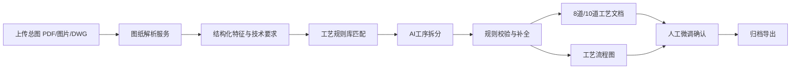
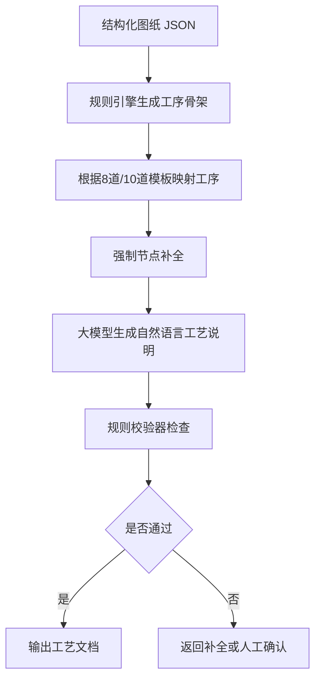

# 曲轴工序拆分系统实现流程

## 一、总体实现路线

本期系统边界明确为：不做 CAD 绘图、不做 DXF 生成、不做工序转 CAD 图纸，只输出：

- 图纸结构化解析结果
- 8道/10道工序方案
- 标准化工艺文本
- 工艺流程图
- 人工确认后的归档结果

推荐整体链路：

## 二、阶段 1：先建立标准数据模型

先不要直接让大模型自由生成工序，否则结果不可控。第一步要把曲轴图纸信息和工序输出格式定义成固定 JSON 结构。

### 1. 图纸解析结果模型

结构化字段建议包括：

- 零件基础信息：零件名称、图号、材料、毛坯类型、热处理要求
- 加工特征：主轴颈、连杆颈、法兰端、油道、螺栓孔、定位销孔、平衡块、打刻区、无倒角区
- 尺寸与公差：关键直径、长度、圆角、同轴度、圆跳动、粗糙度、未注公差
- 技术要求：滚压、磨削、抛光、倒角限制、清洁度、探伤、退磁、动平衡
- 检测要求：多截面测量、分组规则、终检项目
- 风险标记：识别不确定字段、缺失字段、需人工确认字段

### 2. 工序输出模型

每道工序固定输出：

- 工序编号
- 工序名称
- 加工对象
- 操作内容
- 关键控制点
- 所需设备/工装，可选
- 检测项目
- 对应图纸依据
- 是否强制节点
- 是否需要人工确认

这一步是系统稳定性的基础。

## 三、阶段 2：构建曲轴工艺规则库

规则库不要一开始做成复杂知识图谱，建议先用“规则表 + 工序模板 + 校验器”实现，后续再升级。

### 1. 基础工艺原则规则

固化以下顺序原则：

- 先毛坯处理，后切削加工
- 先基准，后外形
- 先粗加工，后半精加工，再精加工
- 先主轴颈/连杆颈主体加工，再孔系加工
- 精磨/滚压后进入尺寸检测
- 探伤、动平衡、清洁、终检不能遗漏

### 2. 强制工艺节点规则

根据图纸技术要求触发：

- 出现磁粉探伤要求：必须生成探伤节点
- 出现退磁要求：探伤后必须补退磁
- 出现动平衡要求：必须生成动平衡节点
- 出现分组打刻要求：必须生成尺寸分组与打刻节点
- 出现油道/清洁度要求：必须生成深度清洗节点
- 出现滚压要求：必须进入轴颈精加工工序
- 出现无倒角区域：必须写入相关工序管控点

### 3. 双版本工序模板

系统内置两个标准模板：

8道标准工序：

1. 毛坯预处理
2. 两端面铣削及中心孔加工
3. 粗车整体外形
4. 半精车轴颈与过渡面
5. 法兰及孔系加工
6. 精磨与滚压精加工
7. 分组打刻、无损检测与动平衡
8. 深度清洗与终检入库

10道精细工序：

1. 毛坯修整
2. 端面加工
3. 基准中心孔加工
4. 粗车成型
5. 半精车精修
6. 孔系加工
7. 轴颈精磨滚压
8. 尺寸检测与分组打刻
9. 去毛刺外观精修与特种检测
10. 深度清洗与成品终检

## 四、阶段 3：图纸解析实现

### 1. PDF/图片解析

实现方式：

- PDF 转图片，按页处理
- OCR 提取标题栏、技术要求、尺寸标注文本
- 多模态大模型识别图纸区域、曲轴特征、局部视图说明
- 输出结构化 JSON

重点不是“看懂所有几何线条”，而是优先识别工艺相关信息：技术要求、尺寸公差、检测说明、特殊工艺备注。

### 2. DWG 解析

因为不做 CAD 生成，但仍可解析 DWG：

- 读取文字实体、标注实体、图层信息、块信息
- 提取尺寸、公差、技术要求、标题栏
- 必要时把 DWG 渲染成图片，再走多模态识别

DWG 在本期只作为输入解析来源，不做任何输出绘图。

## 五、阶段 4：AI 工序拆分实现

推荐采用“规则引擎主导 + 大模型补全文本”的方式，而不是让大模型直接决定全部工序。

### 推荐职责划分

- 规则引擎：决定有没有这道工序、顺序对不对、强制节点是否存在
- 大模型：负责把结构化信息转成专业、统一、可读的工艺文本
- 校验器：负责检查遗漏、冲突、顺序错误、字段缺失
- 人工确认：负责处理识别不确定、企业习惯差异、特殊订单要求

这样可控性最高，也方便验收。

## 六、阶段 5：工艺流程图生成

流程图不需要 CAD。可以用流程图 DSL 或前端图形库生成。

推荐实现：

- 后端输出流程节点 JSON
- 前端用流程图库渲染
- 节点类型分为：加工、检测、特殊工艺、清洗终检、人工确认
- 支持导出 PNG/PDF，用于归档

节点数据结构包含：

- 节点编号
- 节点名称
- 节点类型
- 上游节点
- 下游节点
- 关键管控点
- 对应工序编号

## 七、阶段 6：人工微调与知识沉淀

人工编辑不要只做普通文本框，要保留结构化能力。

需要支持：

- 修改工序名称
- 增删工序
- 调整工序顺序
- 修改加工内容和管控点
- 标记 AI 识别错误
- 保存为企业规则样本

人工修改后的数据进入“工艺案例库”，用于后续优化提示词、规则和模板。

## 八、阶段 7：验收与测试方法

验收不要只看大模型回答是否像样，要按字段和规则逐项验证。

建议测试集：

- 常规曲轴图纸
- 带滚压要求图纸
- 带磁粉探伤和退磁图纸
- 带动平衡要求图纸
- 带分组打刻要求图纸
- 带复杂孔系图纸
- 扫描质量较差的 PDF/图片
- DWG 矢量图纸

核心指标：

- 图纸关键特征提取完整率
- 特殊工艺识别召回率
- 工序顺序正确率
- 强制节点遗漏率
- 人工修改次数
- 单张图纸生成耗时

## 九、推荐技术模块划分

系统可拆成 7 个后端模块：

1. 文件上传与任务管理模块
2. 图纸预处理模块
3. 多模态图纸解析模块
4. 工艺规则库模块
5. 工序拆分与文本生成模块
6. 工序校验模块
7. 流程图与归档导出模块

前端主要页面：

1. 图纸上传页
2. 图纸解析结果页
3. 8道/10道工序方案页
4. 流程图预览页
5. 人工编辑确认页
6. 历史归档页

## 十、实际开发优先级

第一版 MVP 建议只做最小闭环：

1. PDF/图片上传
2. 多模态识别技术要求和加工特征
3. 8道/10道模板生成
4. 规则校验强制节点
5. 工艺文本输出
6. 流程图展示
7. 人工修改保存

DWG 解析可以放在第二版，因为 DWG 兼容和实体解析成本较高，但本期接口可以先预留。